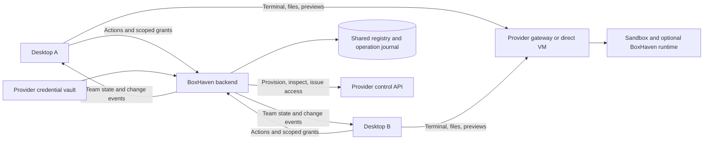

# Sandbox connectors for BoxHaven Desktop

Status: architecture proposal, not implemented. Research checked September 27,
2026 (Pacific). Repository baseline: `14074a1`.

## 1. Recommendation

Keep the **BoxHaven backend as the required control plane and team sync point**
for every provider. Run provider lifecycle adapters there. The desktop uses one
BoxHaven API for shared state and authorization, plus a common local transport
layer for direct terminal, file, and preview access.

The goal is **one API for the desktop, with accurate provider semantics**. A single
universal wire protocol cannot provision all these services: their account APIs,
image formats, permission boundaries, and retention models differ. Adding a
provider should mostly require an adapter and integration tests rather than
changes throughout the application.

The backend owns team membership, connected provider accounts, resource identity,
lifecycle operations, access policy, session/run records, and synchronization
between devices. The provider remains the authority for actual compute state;
the backend reconciles that state into the shared registry. Desktop state is a
cache, never an independent inventory that teammates must manually synchronize.

Use direct laptop-to-provider connections for terminal bytes, file contents,
command output, and previews. Backend traffic consists of coordination and bounded
control requests. This reduces bandwidth and connection pressure while preserving
the backend's role in every connection.

Bring-your-own-provider and BoxHaven-funded capacity describe who supplies the
account and pays the provider. Both use the same backend and team model. A solo
user uses their personal team, as the existing backend already supports. Hosted
and self-hosted BoxHaven use the same architecture.

Initial scope: Linux development sandboxes, macOS desktop, existing BoxHaven plus
E2B, Daytona, Blaxel, exe.dev, and Boat. Team coordination ships with the connector
foundation. Windows/macOS guest environments, GPU workloads, remote graphical
desktops, and additional providers are extensions.

### Decisions to adopt

1. Centralize provider control, shared state, and access grants in the backend;
   keep bulk I/O direct between the desktop and provider.
2. Prefer provider-native PTYs and file APIs when they support sufficiently scoped
   access. Retain certificate SSH for existing BoxHaven machines and use a shared
   runtime bridge where the native path cannot meet the terminal or access contract.
3. Model closing a connection, pausing memory, stopping compute, archiving disk,
   and deleting data as distinct operations.
4. Store provider account credentials in the backend vault. Keychain holds the
   desktop's BoxHaven login; scoped connection grants stay in privileged processes.
   Never expose account credentials to teammates' desktops, previews, or guests.
5. Support existing resources without silently installing software, changing
   retention, or claiming authority over unrelated resources in a provider account.
6. Require real provider and multi-device conformance runs before calling a
   connector supported.

## 2. Provider research

The entries below distinguish published capabilities from proposed integration
choices. No paid sandbox was provisioned for this research. Documentation is
evidence of an API contract, not proof of our implementation or account entitlements.

### The five requested providers

| Provider | Published access model | Persistence and images | Recommended integration |
| --- | --- | --- | --- |
| **E2B** | TypeScript SDK with commands, files, and reconnectable PTYs. Its SSH guide builds OpenSSH plus a WebSocket bridge into a template. Controller and preview access use different tokens. | Pause can preserve memory and filesystem; disk-only pause also exists. Snapshots and forks are documented. Templates supply prepared environments. Continuous execution has plan limits. | Native PTY/files after scoped-delegation checks; use the runtime where required. Prepared templates enable the agent workflow. Track execution deadlines independently of resource existence. |
| **Daytona** | Native process sessions, PTYs, files, expiring SSH access tokens, and previews. | Containers retain files across stop/start but do not preserve memory. VM classes support memory pause/resume and hot snapshots. Images, snapshots, and volumes have separate roles. | Native PTY/files where safe delegation is proven; otherwise use the shared runtime. Resolve capabilities by sandbox class and use port-scoped signed preview URLs. |
| **Blaxel** | Process/files APIs, private previews, and expiring client sessions explicitly intended for direct access without an application proxy. | Automatic standby preserves state. Unattended computation needs process keep-alive. Snapshot/fork and archive docs currently mark those features private preview. | Native files/process APIs plus the common PTY bridge unless a suitable native PTY is confirmed. Use client sessions for delegated access and explicitly manage task lifetime. |
| **exe.dev** | SSH gateway and HTTPS proxy. HTTPS command API can provision and run bounded commands but has no stdin/PTY and a 30-second request limit. VM HTTPS tokens can be scoped and expire. | OCI images and first-boot setup scripts. Persistent VMs and a `cp` operation are documented; do not assume `cp` is a memory fork. Shared account capacity differs from per-VM billing. | Provision over HTTPS; run the common bridge behind the provider's private HTTPS proxy. First prove authenticated WebSockets and long transfers. |
| **Boat** | REST/TypeScript/Python APIs, command/file APIs, direct SSH, protected HTTPS hosting, and integrated agent APIs. Scoped API keys are documented. | Stop archives filesystem state; resume reboots and restarts enabled services. Running processes are not preserved. Forks and named snapshots exist. Snapshot exclusions and environment inheritance matter. | Native control/files plus the shared bridge for direct terminals. Build a prepared Boat template. Use safe-for-third-parties environments and explicit workload credentials. |

Primary references: E2B [PTY](https://docs.e2b.dev/sandbox/pty),
[SSH](https://docs.e2b.dev/sandbox/ssh-access),
[persistence](https://docs.e2b.dev/sandbox/persistence),
[snapshots](https://docs.e2b.dev/sandbox/snapshots),
[limits](https://docs.e2b.dev/billing); Daytona
[PTY](https://www.daytona.io/docs/en/pty/),
[persistence](https://www.daytona.io/docs/en/persistence/),
[preview](https://www.daytona.io/docs/en/preview/); Blaxel
[sessions](https://docs.blaxel.ai/Sandboxes/Sessions),
[processes](https://docs.blaxel.ai/Sandboxes/Processes),
[standby](https://docs.blaxel.ai/Sandboxes/Overview),
[fork](https://docs.blaxel.ai/Sandboxes/Fork),
[archive](https://docs.blaxel.ai/Sandboxes/Archive); exe.dev
[API](https://exe.dev/docs/https-api),
[VM tokens](https://exe.dev/docs/https-tokens-for-vms),
[images/setup](https://exe.dev/docs/customization),
[copy](https://exe.dev/docs/cli-cp); Boat
[API](https://docs.boat.dev/api/v1),
[snapshots](https://docs.boat.dev/snapshots),
[platform integration](https://docs.boat.dev/platform-guide).

### Details that materially affect the design

- **E2B:** secured controller access does not make preview ports private.
  Configure preview authentication separately. Taking a snapshot drops active
  PTY/command/WebSocket connections even though the source returns to running.
  Reconnect must not accidentally rerun an agent command.
  [Controller security](https://docs.e2b.dev/sandbox/secured-access),
  [preview security](https://docs.e2b.dev/network/restrict-public-access),
  [snapshot behavior](https://docs.e2b.dev/sandbox/snapshots).
- **Daytona:** a standard preview token is sandbox-wide, including sensitive
  internal ports. A signed preview URL is port-scoped, expiring, and revocable.
  Organization API-key scopes do not isolate runtime access between sandboxes
  in that organization. A restricted organization key is unsuitable as an
  end-user runtime credential in a shared managed account.
  [Preview authentication](https://www.daytona.io/docs/en/preview/),
  [API-key permissions](https://www.daytona.io/docs/en/api-keys/).
- **Blaxel:** detached does not mean continuously executing. Without keep-alive,
  a process can be suspended when the sandbox enters standby. `keepAlive: true`
  without an explicit timeout has a documented ten-minute auto-kill default.
  Provider heartbeats can also defeat idle savings; avoid copying BoxHaven's
  always-connected VM agent unchanged.
  [Process lifetime](https://docs.blaxel.ai/Sandboxes/Processes),
  [standby control](https://docs.blaxel.ai/Sandboxes/Standby-control).
- **exe.dev:** the issue's backend SSH tunnel is one implementation choice. A
  bridge in the VM could use the provider proxy instead. Its command API is
  sufficient for provisioning, not interactive I/O. Long-lived WebSockets remain
  an empirical gate, not a confirmed capability in this plan.
  [API limits](https://exe.dev/docs/https-api), [proxy](https://exe.dev/docs/proxy).
- **Boat:** `idle` can describe the integrated agent queue while an independently
  launched process is busy. Stop must wait for its final snapshot; a refused stop
  is not success. Shared-account sandboxes must not inherit the owner's repository
  or agent credentials. [API states](https://docs.boat.dev/api/v1),
  [snapshot behavior](https://docs.boat.dev/snapshots),
  [environment isolation](https://docs.boat.dev/environments).

Normalize observable behavior, not just method names.

### Broader provider coverage

These are researched expansion candidates, not certified connectors. Their first
task is a conformance spike against the same contract.

| Provider | Reusable route | Additional constraint |
| --- | --- | --- |
| **Modal** | SDK and authenticated HTTP/WebSocket connect tokens; common bridge where needed. | Model app/environment identity, execution deadlines, and filesystem versus memory snapshots separately. [Networking](https://modal.com/docs/guide/sandbox-networking), [sandboxes](https://modal.com/docs/guide/sandboxes). |
| **Vercel Sandbox** | JS SDK for named sandboxes, commands, files, and ports. | Current docs describe filesystem persistence across sessions. Logical sandbox and running VM session are different identities. Prove interactive terminal access separately; command output is insufficient. [SDK](https://vercel.com/docs/sandbox/sdk-reference). |
| **Cloudflare Sandbox** | Authenticated Worker bridge for lifecycle, files, and terminal WebSockets. | Requires deployment in the customer's account, not just an API key. Traffic traverses that Worker. Pin one SDK release; stable and 1.0-preview APIs differ. [HTTP bridge](https://developers.cloudflare.com/sandbox/bridge/http-api/), [terminal](https://developers.cloudflare.com/sandbox/api/terminal/). |
| **Deno Sandbox** | SDK, exposed HTTP, and provider SSH. | Default lifetime follows the client session. Explicit timeouts and durable volumes matter for disconnectable work; certify the bridge or an approved SSH integration. [SSH](https://docs.deno.com/sandbox/ssh/), [timeouts](https://docs.deno.com/sandbox/timeouts/), [volumes](https://docs.deno.com/sandbox/volumes/). |
| **Runloop** | Devbox SDK, commands/files, HTTPS tunnels. | Suspend preserves disk, not processes; lifetime policy and snapshots are separate. Prove the interactive terminal path. [Lifecycle](https://docs.runloop.ai/docs/devboxes/lifecycle), [tunnels](https://docs.runloop.ai/docs/devboxes/tunnels). |
| **CodeSandbox** | SDK connection/session and terminal integration to investigate. | Public overview documents fork/hibernate; detailed docs were inaccessible in this review. Require source inspection and live persistence/auth tests before assigning capabilities. [Official overview](https://codesandbox.io/sdk). |
| **OpenSandbox** | Adapter to its lifecycle and execution APIs. | A runtime platform/protocol, not a universal commercial-provider adapter. Useful for self-hosted Docker/Kubernetes. [Repository/specifications](https://github.com/opensandbox-group/OpenSandbox). |
| **DigitalOcean / Hetzner** | Existing control plane and certificate SSH. | Preserve working implementations; generalize endpoint addresses beyond IPv4. [Current providers](docs/providers.md). |

Other vendors qualify through the same requirements: addressable resources,
authenticated execution, bidirectional terminals or a hostable bridge, file
transfer, explicit lifetime semantics, and an accountable deletion path. An
exec-only service can support a jobs extension but is not a complete interactive
connector.

## 3. Architecture and traffic paths



### Backend connector host

The backend hosts provider control adapters, credential references, catalogs,
reconciliation, operation workers, and the access broker. Reuse Better Auth and
existing team membership checks. Every connection, resource, operation, session,
run, and grant has a team ID checked on every API call and event subscription.
Do not trust the client's selected team or possession of a resource UUID alone.

Use isolated backend workers per credential scope when an SDK relies on global
environment variables. Explicit-credential REST clients may be simpler. A worker
isolates crashes and accidental credential mixing; it is not a security sandbox
for untrusted plugins. Initially ship reviewed, pinned adapters with the product.

### Desktop transport host

Run connection code outside the renderer in Electron utility processes. The host
owns the BoxHaven login, short-lived access handles, terminal streams, local
transfer paths, and a disposable cache of shared state. It does not provision or
list provider resources using an account API key.

Renderer IPC exposes resource IDs and typed actions, not arbitrary fetch or
subprocess access. Preview content must not reach connector IPC. Share transport
contracts and tested provider helpers in TypeScript packages; keep Electron and
Keychain imports out of backend packages.

### Provider ownership and delegated access

| Capacity source | Account credentials | Lifecycle caller | Terminal/file caller |
| --- | --- | --- | --- |
| User/team connects its own provider account | Backend vault, tied to an authorized team connection | Backend adapter | Desktop directly with a resource-scoped grant |
| BoxHaven supplies provider capacity | Backend vault, with explicit tenant resource assignments | Backend adapter | Desktop directly with a resource-scoped grant |

Connecting an account is an explicit credential-sharing step with the selected
BoxHaven backend. Validate read-only identity/scope, then store an encrypted secret
reference; never return the credential in team settings or events. Selecting
which existing resources to import is separate from granting connection access.
A team connection must not reveal unrelated provider resources to ordinary members.

Authorize through Better Auth/team policy before minting access. Never send an
account API key to a desktop to compensate for missing delegation. Where native
PTY/files require an overbroad key, use sandbox-scoped credentials or the common
runtime bridge. If no direct, adequately scoped route exists, that provider cannot
ship the affected team capability. Validate this before committing to native PTY.

### Shared records and synchronization

Extend the existing backend database with records for:

- Connections: team, provider account/project scope, credential reference,
  credential version, billing owner, status, and allowed catalog.
- Resources: stable BoxHaven ID, team, connection, provider ID, runtime generation,
  desired and observed state, observation time, ownership, and retention policy.
- Operations: actor, action, idempotency key, request hash, resource/version,
  provider request ID, result, and recovery state.
- Sessions/runs: resource generation, remote session ID, initiator, work directory,
  selected agent, start/end state, and execution deadline. Sensitive command
  arguments and environment values stay out of ordinary shared metadata.
- Grants/audit: actor, resource/session scope, permissions, expiry, revocation
  status, and lifecycle/access events. Store token identifiers/hashes, not reusable
  bearer secrets in event payloads.

Use a transactional outbox and ordered team change events over SSE. A desktop
loads a snapshot with a cursor, subscribes after that cursor, deduplicates events,
and resynchronizes if the cursor falls outside retention. Events carry record
revisions; stale observations cannot overwrite newer operations. Authorization
changes terminate affected subscriptions and invalidate cached views.

The backend serializes conflicting lifecycle operations per resource using stored
versions and durable operation claims. Request idempotency also survives two
laptops retrying the same operation. Provider console changes are discovered by
reconciliation; store them as observed changes rather than pretending the backend
has exclusive control over the cloud account.

### Team session behavior

Example: Alice creates an E2B box and starts an agent through BoxHaven. The backend
records the resource and run, and Bob sees them through the team event stream.
After authorization, Bob receives a fresh grant and connects directly to that
sandbox. Alice closing her laptop changes attachment presence, not resource or
run ownership. Neither teammate needs the other's API key.

Record run intent before invoking a remote start. Use a stable run/session ID and
runtime/provider reconciliation so an ambiguous result does not launch the agent
twice. Session records enable discovery; successful attach still requires a live
remote session. Disk-only resume cannot recover a terminated process.

Initial collaboration means shared inventory, operations, run discovery, and
independent terminals on an authorized box. Shared viewing or control of one
terminal is a capability requiring remote enforcement. Use a single-writer lease
and explicit handoff only where the provider/runtime enforces it; a UI-only lease
cannot stop another connected client from typing. A sandbox-access grant normally
allows access to that sandbox's contents; do not imply per-process isolation.

Keep terminal transcripts and file contents on the resource/direct path. The
backend synchronizes bounded metadata and lifecycle events. Client attachment
presence is advisory, expires when updates stop, and never proves that remote
work is executing. Use provider/runtime observations for run status, and expose
unknown or stale status when no non-disruptive observation is available.

### Revocation and backend outages

Membership removal or credential revocation stops new grants and renewals.
Document and test whether each provider revokes established streams, not only
new connections. Token/certificate expiration at handshake does not necessarily
terminate an already-open SSH or WebSocket session.

For the common runtime, enforce renewable access leases on open connections;
expiry closes the attachment without killing the detached workload. Define the
maximum revocation delay as part of team policy. Native transports must prove
comparable enforcement or accurately declare their limitation. Existing
certificate SSH requires its own active-session revocation work if teams need
that guarantee; do not claim certificate expiry already provides it.

During a backend outage, desktops show cached state as stale. Existing direct
attachments may continue only within their transport's authorized access window;
new grants and lifecycle operations require backend recovery. Remote workloads
follow their recorded lifetime policy independently of viewers. Do not silently
queue destructive actions for execution after reconnect. Reconcile state and
replay team events after recovery.

### Reusable transports

1. **Native PTY:** E2B and Daytona first where scoped delegation is proven.
   Normalize bytes, resize, detach/reattach, exit, flow control, and reconnect
   into one terminal handle. Use the common runtime when native authorization
   cannot satisfy team access policy.
2. **Certificate SSH:** current BoxHaven machines. Preserve backend-signed,
   short-lived certificates, persistent host-key pinning, and rsync.
3. **Runtime over provider HTTPS/WebSocket:** a service inside the sandbox supplies
   missing PTY/session/file operations. Useful for exe.dev and potentially
   Blaxel/Boat. Provider authentication plus runtime authorization protects it.

Choose the certified transport during capability resolution. A failure reports
its cause; never silently switch to weaker authentication.

The generic API does not require SSH. Avoid forcing every sandbox to install sshd
or every provider to understand BoxHaven certificates. Existing SSH rules remain
intact wherever BoxHaven uses direct SSH. Provider-native SSH-token flows are
possible extensions with an explicit security-policy decision before implementation.

### Backend load budget

- New connector terminal, file, command-log, and preview payload bytes through
  BoxHaven's backend: **zero**.
- Backend requests for every connector: provisioning, authorization, grant
  renewal, reconciliation, bounded run control, metadata, and team change events.
  This is intentional control-plane load and must be measured.
- Reconcile once per provider connection and fan out authorized cached state to
  desktops. Do not multiply provider polling by team size. Use one team event
  subscription per active desktop, bounded queues, and reconnect backoff.
- Coalesce presence updates; never send an event per keystroke or output chunk.
  Measure API QPS, event fanout, reconciliation latency, and database growth as
  separate budgets from bulk bandwidth.
- Existing DO/Hetzner preview proxy traffic remains; this plan does not claim
  that path already bypasses the backend.
- A customer Worker or provider gateway may carry traffic and incur provider
  charges. Neither a central BoxHaven relay nor a VPN is mandatory.

## 4. Connector contract

Own the contract in BoxHaven. The **backend provider adapter** handles provider
control; the **desktop transport adapter** consumes delegated access. The public
BoxHaven API applies authorization and shared-state transactions around provider
operations. Do not expose SDK objects or account credentials to the renderer.

This is an interface outline, not a drop-in implementation. The first code change
must make the contracts compile and add schema validation.

```ts
// Backend only. Bound to a validated team connection and vault reference.
interface ProviderControlAdapter {
  describeAccount(): Promise<AccountSummary>;
  capabilities(target?: ResourceRef): Promise<Capabilities>;
  catalog(): Promise<ResourceCatalog>;
  list(query: ListQuery): Promise<Page<SandboxSummary>>;
  inspect(ref: ResourceRef): Promise<SandboxDetails>;
  create(spec: CreateSpec, context: OperationContext): Promise<ProviderOperation>;
  getOperation(id: string): Promise<ProviderOperation>;
  cancelOperation(id: string): Promise<CancelResult>;
  perform(ref: ResourceRef, action: LifecycleAction,
          context: OperationContext): Promise<ProviderOperation>;
  startRun(ref: ResourceRef, spec: RunSpec,
           context: OperationContext): Promise<RemoteRun>;
  issueAccess(ref: ResourceRef, request: AuthorizedAccessRequest): Promise<AccessGrant>;
  revokeAccess(grant: GrantRef): Promise<RevocationResult>;
}

// Privileged desktop process. Holds only delegated resource/session access.
interface SandboxTransport {
  connect(grant: AccessGrant): Promise<AccessHandle>;
  openTerminal(access: AccessHandle, spec: TerminalSpec): Promise<TerminalHandle>;
  attachExecution(access: AccessHandle, run: RemoteRunRef): Promise<ExecutionHandle>;
  files(access: AccessHandle): FileAccess;
  openPreview(access: AccessHandle, request: PreviewRequest): Promise<PreviewHandle>;
}

type LifecycleAction =
  | { kind: "pause-memory" }
  | { kind: "stop-compute" }
  | { kind: "archive-filesystem" }
  | { kind: "resume" }
  | { kind: "snapshot"; preservation: "filesystem" | "memory" }
  | { kind: "fork"; source: SnapshotOrResource; preservation: "filesystem" | "memory" }
  | { kind: "delete"; expectedGeneration: string };

interface TerminalHandle {
  id: string;
  output: AsyncIterable<Uint8Array>;
  write(bytes: Uint8Array): Promise<void>;
  resize(columns: number, rows: number): Promise<void>;
  detach(): Promise<void>;       // Does not terminate remote work.
  terminate(): Promise<void>;    // Explicitly ends this terminal.
  closed: Promise<TerminalExit>;
}
```

Backend APIs cover team connections, catalogs, resources, lifecycle operations,
run/session registration, grants, and cursor-based change events. Every mutation
has an actor, team, idempotency key, and expected resource revision where relevant.
Use the existing route/auth infrastructure and map legacy machine identities
through an explicit database migration when implementing the new contract.

`AccessGrant` is returned only after backend authorization and consumed by the
privileged desktop host. `AccessHandle` stays there; renderer IPC carries its ID,
never secrets. Bulk I/O uses bounded MessagePorts or equivalent streaming IPC,
not base64 blobs in ordinary request/response messages.

### Resource identity

Give each backend connection a stable `connectionId`. Resource references contain
the team ID, connection ID, provider account/project/organization scope, provider
resource ID, and observed incarnation/generation. Keep display names separate.

Persist a stable backend resource UUID mapped to the provider reference. If a
provider uses mutable names or replaces a VM on resume, preserve the logical UUID
and update its runtime generation. Never key sessions by display name.

Store provider resource, runtime instance, terminal session, agent run, operation,
image/template, snapshot, volume, and preview grant as separate concepts. Record
`ownership: created | imported`, provenance, last successful observation, last
connection error, and raw provider status.

An API timeout or incomplete inventory page must not remove resources or kill
terminals. Deletion requires confirmed absence or a completed delete operation,
not omission from a failed list call.

### State and capabilities

Model provisioning, running, paused, stopped, archived, deleting, deleted,
failed, and unknown. Track transport connectivity, runtime readiness, and agent
activity separately. Preserve raw provider states for diagnosis.

Capabilities carry semantics and evidence. Resolve them from provider support,
account permissions, sandbox class, runtime version, network policy, and state.

| Capability | Required detail |
| --- | --- |
| Terminal | Transport, resize, detach/reattach, replay support, connection lifetime |
| Unattended work | Survives app exit, execution deadline, renewal owner, idle policy |
| Pause / stop | Memory/filesystem/identity/volume preservation; connection invalidation |
| Snapshot / fork | Capture scope, exclusions, consistency, source interruption, restore target, retention |
| Files | Streaming, limits, permissions, symlinks, resumability |
| Preview | Port scope, authentication, expiry, revocation, browser compatibility |
| Images | OCI/template/VM snapshot; architecture, user, writable paths |
| Resources | Plans versus numeric CPU/RAM; selectable versus account-wide region |
| Delegation | Account/sandbox/port scope; expiry, new-connection revocation, active-stream revocation, maximum delay |

Represent `supported`, `unavailable` with reason, and `unknown` separately.
Private-preview APIs are not production support. Capability-driven UI reflects
actual resources; it must not become a rollout-feature-flag system.

### Errors, events, and versioning

Normalize authentication, permission, quota, unavailable capacity, rate limit,
not found, conflict, timeout, unsupported operation, and unknown outcome. Include
retryability, retry-after, operation/resource IDs, and a redacted provider cause.
A transport timeout does not establish that provisioning failed. A command exit
code is an execution result, not a connector transport error.

Expose typed resource/operation/session events through the backend team stream.
Use backend record revisions and observation timestamps so late list responses
cannot replace a newer lifecycle result. An operation result identifies created
resources, snapshots, and access changes explicitly; a fork never overwrites its source.

Version the local IPC and guest protocol separately from vendor SDK versions.
The backend and signed desktop ship tested control/transport adapter sets. A
runtime mismatch gets an explicit upgrade/setup action; support one current
protocol rather than silently loading compatibility code.

## 5. Reliable operations and execution lifetime

### Provisioning and reconciliation

Journal in the backend before creating a billable resource: operation UUID,
team/account scope, request hash, provider request ID, discovered resource ID,
state, and last error.
Persist across backend/client crashes; workers claim operations with expiring
leases and recheck state before resuming. Use provider idempotency keys where
available. Otherwise attach a unique operation marker and reconcile before
repeating an ambiguous
request. If neither mechanism exists, keep an `outcome-unknown` operation rather
than blindly retrying. Boat documents create/fork idempotency with bounded
retention. [Boat API](https://docs.boat.dev/api/v1).

Closing a desktop request cancels waiting; it does not cancel the backend job.
Explicit cancellation returns whether provider cancellation was confirmed.
Confirm provider removal before completing deletion;
report snapshots and volumes retained under a separate policy.

### Closing the app

Preserve the canonical workflow: create, start an agent, disconnect, reconnect.
Before unattended work starts, record the guaranteed execution deadline, idle
policy, renewal owner, and what happens when the laptop goes offline.

Use detached execution and provider keep-alive where supported. An Electron timer
cannot guarantee execution after laptop sleep. Never advertise indefinite work on
a finite provider lease. Users can choose a sufficient supported duration,
checkpoint/resume, or a backend-managed renewal policy with a cost ceiling.
The backend scheduler owns those renewals and their audit records. It generates
control requests, not terminal traffic; show the provider-enforced deadline if
the scheduler is unavailable.

A preserved process may be suspended and making no progress. “Paused with state
saved” and “agent still executing” must remain different product states.

### Reconnecting

Refresh grants/endpoints and inspect without waking a sleeping resource where
possible. Reattach to the same logical session. If only disk survived, report
that the old process ended and offer its saved agent conversation or a new shell.
Never fabricate terminal continuity or replay the initial command automatically.

Mark gaps in output replay. Agent run identity is separate from a PTY PID.
Disconnecting a viewer must not send a termination signal to the workload.

### Polling

Use pagination, bounded concurrency, in-flight deduplication, jitter, and rate-limit
backoff. Do not ping each guest every 15 seconds: that can wake sandboxes and incur
charges. The backend reconciles each provider connection once and consumes
verified provider webhooks where available. Desktops subscribe to its team state
instead of polling providers independently. Guest probes are tied to user actions
or explicit active-work policies; reconciliation must continue with all apps closed.

## 6. Portable BoxHaven runtime and images

Native access is sufficient to browse/connect to compatible existing resources.
The full agent workflow can use a prepared runtime for session setup, tmux,
command wrapping, and status.

Extract the existing runtime from
[remote-vm-install.sh](cmd/bh/assets/remote-vm-install.sh) into a standalone tested
package. Keep setup/session logic there rather than adding provider-specific
shell scripts to the desktop or Go CLI.

Support systemd on ordinary VMs and a provider process/entrypoint in sandboxes.
Systemd must not be part of the runtime protocol. Declare the workspace path:
retain `/opt/boxhaven/project` for current images and allow an explicit writable
path in sandbox profiles. Update AGENTS.md and affected contracts when implementing
that generalization.

### Common bridge

Implement only missing operations: authenticated PTY/session attach, resize,
bounded output, runtime inspection, and streaming files if native APIs are
insufficient. Avoid an unrestricted TCP relay. Use a packaged PTY component and
one versioned protocol; do not write SSH/TLS/cryptographic primitives.

Reserve a runtime port separate from app previews and prevent public sharing of
that port. Bind as required by the provider's ingress; loopback alone can be
unreachable. Where available, use provider-scoped authentication as the outer
gate. Runtime grants bind to team, actor, resource generation, allowed operation,
and expiry. The backend issues every grant. A runtime trusts its provisioned
resource identity and the backend signing authority, and checks authorization
when attaching and renewing a live connection. Never put provider account
credentials in the guest. Use established token libraries and review the new
service boundary before shipping.

This grants resource access; it does not replace hosted user login. Existing
hosted identity remains Better Auth.

### Artifact pipeline

One source recipe produces multiple provider artifacts; a single image cannot
serve every provider. Manifest fields include runtime version, architecture,
provider, region, source commit, recipe digest, and immutable artifact identity.

- DO/Hetzner: existing VM snapshots.
- E2B: templates with the required controller version.
- Daytona: supported image/snapshot builds per sandbox class.
- Blaxel: compatible OCI images retaining its required runtime.
- exe.dev: OCI image with its setup entrypoint.
- Boat: prepared sandbox saved as a named template/snapshot.

Install tools while building artifacts. First boot injects instance identity,
grants, paths, and explicit workload secrets. Probe runtime readiness before
calling a new box ready. An imported sandbox missing tools gets a setup action;
never silently install software on connection.

Clean reusable templates contain no credentials, conversations, instance identity,
or host keys. Active-work memory snapshots are different: they can contain secrets
and running processes. Keep them within the authorized owner boundary. A live
agent fork can duplicate external side effects. Default to quiescing managed runs
and forking filesystem state until safe memory-fork semantics are proven. Label
which behavior users receive.

## 7. Files, previews, and credentials

### Synchronization

Retain rsync for certificate SSH. Else use native streaming file APIs, then the
runtime transfer implementation for providers needing it. Shared sync computes a
manifest, applies `.boxhavenignore`, preserves supported modes/symlinks, uploads
temporaries, atomically replaces files where supported, and verifies hashes.

Require an explicitly selected project directory; never sync the home directory
by default. Distinguish upload, download, and destructive mirror. Preview the
deletion set for a new mirror relationship. Keep memory bounded for large files;
cancellation must not leave truncated files looking complete. Report unsupported
metadata/size requirements. A cross-provider move is export/import, not a portable
VM or memory snapshot.

### Private previews

Return a `PreviewHandle` containing display origin, port, access method, scope,
expiry, and a privileged opener. Keep control credentials out of renderer state.

Choose a preview transport deliberately:

1. Provider-issued port-scoped signed URL or provider browser login.
2. Isolated Electron preview session with auth injected only for the exact
   origin/port. No Node, connector IPC, or shared application cookies. Revalidate
   redirects and WebSocket upgrades.
3. Local loopback proxy for external browsers when only header auth is supported.
   Traffic stays on the laptop. Authenticate the browser session, validate
   Host/Origin, prevent cross-sandbox routing, and strip credentials on redirects.

These are supported access modes, not silent failure fallbacks. Signed URLs are
bearer credentials and need redaction. External browsers may retain them in
history. `shell.openExternal(url)` alone cannot supply E2B/exe.dev auth headers.

### Account and workload credentials

Support multiple provider connections per team. Store account credentials in the
backend vault with encryption keys outside the application database, versioned
secret references, restricted worker access, rotation, and backup/recovery
procedures. Persist only references in ordinary connection records. Validate
connections through read-only identity/list requests, not resource creation.

Use macOS Keychain for the desktop's BoxHaven login, with a vault interface for
later platforms. Keep scoped grants in memory where possible. An explicit
connection flow can import a local provider credential and submit it over TLS
to the selected backend; explain where it will be stored. Teammates receive
connection access through BoxHaven roles, never copies of the original key.

Use official OAuth/device flows where actually available, otherwise API keys with
exact scope instructions. Redact SDK errors, request headers, signed URLs, and
keys from diagnostics. Revalidate connection permissions after credential rotation.

Pin team/account/project/organization scope per operation. Never mutate a global
active organization or region to implement a local dropdown. Isolate SDKs with
global environment credentials in backend account workers or use explicit REST
clients; never switch shared `process.env` credentials around concurrent requests.
Validate provider-returned endpoint origins before attaching credentials. Custom
API endpoints are explicit connection configuration with normal TLS verification,
not arbitrary URLs supplied by a renderer or preview.

Provider account credentials differ from model/Git/agent credentials. Deliver
workload credentials explicitly to selected resources with clear user/team
ownership. Review existing CLI credential forwarding before using it with
imported third-party sandboxes. A team-visible run record must never contain the
underlying model key, Git token, or complete secret-bearing launch environment.

## 8. Provider implementation tasks

### E2B

- Backend SDK lifecycle and access broker; direct scoped PTY, files, and previews.
- Explicit command/PTY timeouts and sandbox expiration policy: unlimited command
  timeout does not mean unlimited sandbox lifetime.
- Verify template/controller versions, including snapshot prerequisites.
- Separate controller credentials from traffic credentials; prove resource-scoped
  delegation and revocation before choosing the native desktop SDK path.
- Map memory/disk pause and snapshots/forks accurately; test dropped-stream recovery.

### Daytona

- Backend-bound organization scope; native PTY/files only with safe delegation.
- Determine container/VM capabilities before offering pause or fork.
- Use signed port URLs for sharing; keep sandbox-wide preview tokens privileged.
- Prove sandbox-scoped access as a release prerequisite; never delegate an
  organization key. Use the shared runtime if native PTY cannot meet this boundary.
- Refresh credentials after stop/start; inspect archive and auto-delete policies.

### Blaxel

- Backend workspace/region scope; native files/processes and backend-issued
  client sessions.
- Prove PTY bridge behind a private preview unless native PTY meets the contract.
- Configure keep-alive/kill-timeout explicitly for unattended agents, then release
  the keep-alive when work finishes.
- Account for the memory-backed writable image layer; attach durable volumes where
  needed. [Storage model](https://docs.blaxel.ai/Sandboxes/Overview).
- Exclude private-preview snapshot/fork/archive from production support until
  available to the account and certified.

### exe.dev

- `/exec` for control/bounded bootstrap, with correct quoting and error parsing.
- Require exact command permissions. VM HTTPS access is separate: offline signing
  requires a registered signing key, not merely a command API token.
- Keep that key in the backend vault; issue expiring VM access tokens after
  team authorization.
- Bake the bridge into the OCI image; verify custom auth headers, ping/pong,
  idle behavior, reconnect, and large transfers through private HTTPS ingress.
- Certify copy semantics; leave pause unavailable unless a matching current API
  is established.
- Model shared subscription capacity; do not show synthetic $0/hour machines as
  though the account were free.

### Boat

- Native REST/SDK control, inventory, files/artifacts, and idempotency.
- Safe-for-third-parties environment or `noEnv: true`, then explicit workload
  credentials. This is provisioning isolation, not a rollout flag.
- Prepared runtime template and service startup after resume; prove private
  WebSocket hosting for terminals.
- Direct SSH is an optimization after configuring BoxHaven certificate trust or
  explicitly revising security policy. Do not introduce reusable SSH keys casually.
- Keep logical identity across replacement machines. Verify snapshot exclusions
  against the chosen project path.
- Keep integrated prompt/conversation APIs in a separate agent extension. Users
  must be able to run their chosen agent without adopting Boat's harness.

## 9. Desktop implementation

Today the desktop calls bundled `bh list`, `bh create`, and `bh connect`.
Terminals are local `node-pty` processes; resource/session maps use names. The
catalog assumes backend-selected providers, regions, fixed sizes, and hourly
prices. Existing renderer isolation and output acknowledgments are useful foundations.

Code to change:

- [Main process](desktop/src/main.cjs)
- [CLI bridge and parsing](desktop/src/cli.cjs)
- [Catalog](desktop/src/catalog.cjs)
- [Preload IPC](desktop/src/preload.cjs)
- [Renderer](desktop/src/renderer.js)
- [Provider contract](backend/src/types.ts) and [registry](backend/src/providers.ts)
- [Shared database and migrations](backend/src/database.ts)
- [Authentication and teams](backend/src/auth.ts)
- [Runtime orchestration/preview proxy](backend/src/server.ts)
- [SSH and rsync](cmd/bh/remote.go)

### User flow

1. **Connections:** sign into BoxHaven, select a team, and add a provider account
   with explicit account/workspace scope. Show credential storage and granted access.
2. **Inventory:** one synchronized sidebar, clear team/account/provider labels.
   Imported sandboxes remain untouched until an explicit action. Signing out of
   a desktop leaves team connections intact. Removing a shared provider connection
   is an authorized team operation with affected-resource and cleanup checks;
   it must not orphan active resources or silently delete them.
3. **New box:** connection, prepared environment, resources, work lifetime. Show
   payer, billing basis, and expiration. Use real catalog constraints.
4. **Work:** common terminal/actions and shared run discovery; distinguish
   resource, connection, attachment presence, and agent status. A teammate can
   open their own terminal or attach where supported. Unsupported actions have
   a useful reason.
5. **Leave and return:** state whether work continues, sleeps, or reaches a
   deadline; recover the same logical session where possible.
6. **Stop/delete:** explain precisely what survives; retain explicit deletion
   confirmation and identity rechecks.

Use validated schemas for provider settings/catalogs. Avoid provider-name checks
throughout renderer code. Prices need a tagged model: metered compute, shared
subscription, prepaid credits, or unavailable estimate. Include storage/egress
where known; never interpret an unknown price as zero or blindly multiply by 730.

Stream terminal bytes with backpressure, preserving the current high/low-watermark
behavior. Bound memory and disconnect unresponsive viewers. Optional saved
transcripts are local, bounded, and redact known credentials; arbitrary terminal
output can still contain user secrets. Never treat output as privileged instructions.

### Package layout

```text
packages/connectors-core/       contracts, identity, operations, lifetimes
packages/connectors/            provider control adapters and access mappings
packages/transports/            scoped native PTY, certificate SSH, runtime WebSocket
packages/runtime/               shared guest session/command implementation
backend/src/connectors/         provider workers, vault integration, access broker
backend/src/team-sync/          registry, journal, outbox, reconciliation, event API
desktop/src/connectors/         direct transports, IPC, login vault, shared-state cache
deploy/providers/              artifact recipes and release manifests
scripts/smoke-connectors/       provider and multi-device conformance fixtures
```

Preserve current DO/Hetzner provisioning and certificate SSH behind the backend
contract. Extend the existing database, Better Auth integration, operation handling,
and runtime orchestration. The current backend is the foundation of the connector
system, including single-user accounts; avoid a second local control plane.

The Go CLI also calls the backend for every provider's inventory and lifecycle.
Share direct-access descriptors and reuse transports where practical rather than
implementing six control SDKs in Go. If a native transport needs a packaged
TypeScript helper, give it a versioned local protocol and include its runtime;
desktop installation must not require user-installed Node.

### Adding a provider

Each provider package exports a manifest, account configuration schema, catalog
mapping, capability resolver, backend lifecycle implementation, and scoped access
bindings for supported transports. Register it in the backend registry and ship
any needed transport module with the desktop; the shared UI renders validated
settings and capabilities from the backend. Its onboarding contribution explains
how to create credentials and identifies any required account deployment.

Acceptance requires an environment recipe if needed, a checked-in conformance
fixture, and support documentation describing tested limits. Reject arbitrary
provider widgets in the renderer. If an API exposes a genuinely new operation,
add a typed optional extension and its shared UI deliberately. Do not grow an
untyped `raw` escape hatch into the product contract.

## 10. Build versus reuse

I inspected [Sandbox SDK](https://github.com/dancer/sandbox) and its
[TypeScript contract](https://github.com/dancer/sandbox/blob/main/packages/core/src/types.ts).
It covers files, commands, ports, and snapshots across eight adapters. PTY, SSH,
and lifecycle often remain on native `raw` objects. Its `stop()` permits
provider-dependent stop/destroy/release behavior.

Reuse useful mappings after license/maintenance review and contribute where
sensible. Own the shared BoxHaven lifecycle contract. Pin dependencies behind our tests;
use a vendor SDK directly when that is clearer than an extra abstraction.

[OpenSandbox](https://github.com/opensandbox-group/OpenSandbox) provides lifecycle
and execution specifications and self-hosted runtimes. Support it as another
provider and consider its protocol ideas; it does not integrate all commercial
accounts for us. MCP can expose connector actions later, but is not the terminal
or file transport. A mandatory VPN adds unnecessary enrollment for providers with
authenticated ingress.

## 11. Release verification

Check in reusable provider-parameterized smoke scripts. Reports include connector
and runtime versions, artifact identity, resource IDs, capability evidence,
timings, cleanup, and redacted errors. Use dedicated accounts/resources and cost
ceilings. Fakes test state machines; real providers prove networking/lifecycle.

| Area | Required evidence |
| --- | --- |
| Accounts/teams | Two teams/accounts with identical names never mix resources, sessions, secrets, events, or deletion targets. Revoked/expired keys fail cleanly. |
| Team sync | Two real desktop clients see creates, imports, runs, renames, and deletes; cursor replay and snapshot recovery preserve order after disconnect. Removing a member prevents new grants/events. |
| Concurrency | Two clients racing start/delete/resume get one valid serialized outcome; backend restart reconciles pending work without duplicate resources or agents. |
| Access revocation | Verify new grants, existing SSH/WS streams, backend outage, credential rotation, expiry, and the documented maximum revocation delay. |
| Provisioning | Crash before/after provider acceptance, reopen, reconcile without duplicate billable resources. |
| Terminal | Full-screen TUI, UTF-8, resize, Ctrl-C, heavy output, reconnect, app quit/reopen, laptop sleep. Detach preserves work. |
| Unattended work | Counter/task makes progress with the app fully quit; distinguish execution from preserved state and verify deadlines. |
| Files | Source tree and large binary round trip; hashes, modes, symlinks, ignore rules, cancellation, path traversal, bounded memory. |
| Previews | HTTP and WebSocket/HMR, auth, expiry/revocation, redirects, cross-port isolation, no account credential leaks. |
| Lifecycle | Disk marker and process identity prove each pause/stop/resume preservation promise. |
| Snapshots/forks | Source interruption, exclusions, child identity, credential isolation, external side-effect policy. |
| Delete | Provider absence confirmed; retained snapshots/volumes recorded. Desktop logout preserves team resources; shared connection removal cannot orphan them. |
| Failure recovery | DNS/auth/429/timeouts/dropped streams/incomplete lists retain state and avoid destructive retries. |
| Direct data/control load | Trace payload paths during terminal flooding and large transfers: backend counters show only bounded coordination. Verify team event fanout, one reconciliation loop per connection, and no per-keystroke events. |
| Backend outage | Cached views become stale; new grants/mutations fail clearly; existing attachments follow real lease semantics; workloads follow recorded provider lifetimes; recovery replays state safely. |
| Desktop | Signed packaged app tests and inspected screenshots of connections, catalog, lifetime, terminal, and destructive actions. |

Specific additions: E2B snapshot stream drops; Daytona class differences/token
rotation; Blaxel app-quit execution and return to standby; exe.dev idle WebSockets
and command quoting; Boat snapshot failure, environment isolation, and replacement
machine after resume.

Measure p50/p95 create-to-first-usable-terminal, split into provider allocation,
image preparation, runtime readiness, and authentication. Provider boot claims do
not establish user readiness. Also measure reconnect latency and idle API activity.

## 12. Implementation sequence

Each step produces independently reviewable commits with focused verification.
Commit and push verified work before the next piece, following AGENTS.md. Ship
connectors when their advertised surface passes; use no rollout feature flags.

| Step | Deliverable | Exit criterion |
| --- | --- | --- |
| **0. Risk probes** | Direct terminal, lifetime, resource-scoped delegation, and active-stream revocation probes for all five. | Viable team access demonstrated before committing to native or bridge transports. |
| **1. Backend foundation** | Contracts, team connections, vault, stable IDs, durable operations, existing-provider adapter. | Existing workflow plus two-team isolation, concurrency, and crash recovery pass. |
| **2. Team synchronization** | Registry/outbox/event API, run/session records, reconciliation, desktop cache and identity migration. | Two desktops see consistent state; reconnect, membership removal, and backend outage pass. |
| **3. Access and runtime** | Access broker, renewals, direct transport contract, extracted runtime/bridge, image pipeline. | Scoped grants and live-session behavior verified; existing certificate SSH remains correct. |
| **4. E2B/Daytona** | Backend adapters, scoped native access where adequate, runtime access where required, private previews. | Two users complete create/run/disconnect/attach/delete and persistence suites. |
| **5. Blaxel/exe.dev/Boat** | Backend adapters and recipes using shared transports. | Common/provider-specific tests, no central bulk relay, documented app-quit behavior. |
| **6. Persistence and release** | Pause/stop/archive/fork, retention, recovery, packaged desktop UX. | Preservation, team permissions, latency/load, and inspected UI tests pass. |
| **7. Broader catalog** | Modal, Vercel, Runloop, Deno, Cloudflare, CodeSandbox, OpenSandbox. | Certified team access/capabilities and explicit deployment prerequisites. |

Team support is part of the first connector milestone. Connecting a team's own
provider account and using BoxHaven-funded capacity share this implementation;
commercial billing integrations can proceed separately.

Planning allowance for one engineer familiar with BoxHaven: 3–5 days for probes,
12–18 for the backend/team foundation and desktop migration, 5–10 for scoped
access and runtime extraction, 12–20 for five provider adapters/artifacts, and
8–12 for multi-device/failure/release verification. Budget roughly **8–13
engineer-weeks**, conditional on the delegation and transport probes. This is an
unmeasured planning range; unavailable provider delegation could change scope.
Wider provider coverage and new billing products are additional.

For each later provider, target an adapter, environment recipe where necessary,
and conformance fixture with no renderer changes. This is a design acceptance
criterion, not a promise of identical integration effort for every vendor.

### User-facing surfaces when behavior ships

Update README, docs including hero/getting-started, desktop docs, console landing
and onboarding, backend README, deployment README, CLI help, and relevant skill
instructions. Preserve runnable create → agent → disconnect → reconnect examples.
Follow skill version/tag requirements if changed; inspect screenshots of affected
UI pages. This proposal changes no supported commands, defaults, UI, or runtime.

## 13. Decisions and empirical gates

1. The backend is the shared authority for every connection, including a solo
   user's own provider account. Team synchronization is a foundation requirement.
2. Prove exe.dev and Boat private WebSockets. If they cannot sustain the bridge,
   work with the vendor on direct access; do not quietly add a central bulk relay.
3. Check the pinned Blaxel SDK for suitable native PTY support; use the bridge
   only if necessary. Process/log documentation alone does not establish PTY semantics.
4. Prove scoped access provider by provider before release. Account/organization
   isolation does not automatically implement BoxHaven per-user permissions.
   Native PTY availability alone does not prove safe delegation to teammates.
5. Define acceptable active-session revocation delay and certify its enforcement.
   Credential expiry that only prevents new logins is a distinct capability.
6. Set lifetime defaults using measured behavior and quotas. The backend owns
   selected renewal policies; show what happens if it cannot reach the provider.
7. Decide artifact ownership: published immutable BoxHaven artifacts where
   possible, account-local builds where required. Track cost, region, visibility,
   and cleanup.
8. Implement the explicit generalization from fixed VM paths/systemd to declared
   sandbox paths/entrypoints while retaining thin clients and certificate SSH.

Recommended first deliverable: provider access/lifetime probes plus the existing
BoxHaven backend exposed through the new team-scoped connector contract. Then
prove two desktops observe and operate the same resources before adding vendors.
