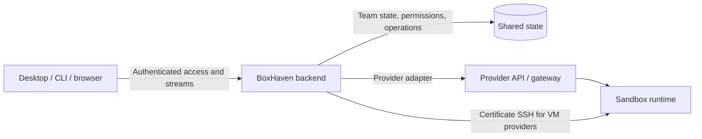

# Sandbox connectors for BoxHaven Desktop

Status: implementation in progress. Implementation updated October 3, 2026 (Pacific).
Provider research below was checked September 27; it is not a claim of shipped support.

## 1. Decision: route interactive traffic through BoxHaven

The backend is both the team control plane and the data relay. The desktop and
CLI connect to one BoxHaven API for terminals, file transfers, and previews.
Provider adapters and account credentials stay on the backend. This replaces the
earlier direct client-to-provider design following Finbarr's October 2 decision.

The extra bandwidth and concurrent connections are intentional service costs.
BoxHaven can charge for managed access. Rates, subscriptions, quotas tied to
plans, and payment collection are separate product work; this change adds none.

### Current implementation

- Stable resource IDs, transactional team events, snapshot/SSE synchronization,
  Better Auth membership checks, viewer/operator sharing, and stable console URLs.
- Durable, idempotent session preparation with an explicit unknown outcome after
  interrupted operations. Remote work survives closing its local attachment.
- exe.dev create/list/destroy, a prepared OCI image, pinned native SSH provisioning,
  and short-lived provider tokens. DigitalOcean and Hetzner remain supported.
- E2B, Daytona, and Blaxel share a sandbox adapter for ownership, provisioning,
  runtime setup, recovery, and private transport. Provider drivers retain their
  own authentication and lifecycle rules. All appear in the existing Boxes flow.
- Prepared E2B templates and Blaxel images have reusable build recipes. E2B leases
  renew from agent heartbeats and paused memory resumes on access. Blaxel uses
  runtime keep-alive and exposes the deletion deadline imposed by account tiers.
- All CLI/desktop SSH attachments connect to a backend WebSocket relay. The backend
  opens either TCP SSH or a provider WebSocket through the common adapter contract.
  The client's SSH certificate and host-key verification remain end to end.
- Private sandbox previews use the backend's provider hook and team-scoped browser
  leases on isolated preview hostnames. Existing public VM previews stay public.
- Active SSH relays check membership, role, team, runtime identity, and expiry.
  Removal, downgrade, move, replacement, and expiry close streams. Per-process
  limits are 128 total, 32 per team, and 8 per actor; backpressure bounds buffering.
- Connection duration and byte counts are logged without payloads or credentials.
  These are operational metrics, not a durable billing ledger.

The backend relay passed its live exe.dev smoke: create, certificate SSH, file
transfer, detached work/reconnect, expiry, private HTTP/WebSocket previews, browser
cookie exchange, membership revocation, and confirmed deletion. The browser test
routes a test hostname to the local backend; production wildcard DNS/TLS was not
changed. No release or deployment is implied by this local implementation.

E2B and Blaxel also passed the full live smoke, including backend restart,
access revocation, private previews, and confirmed cleanup. E2B passed memory
pause/resume with existing sessions and host-key pinning intact. Daytona can
create the prepared runtime, but this test account's Tier 1 firewall blocks the
backend domain. Its actionable setup error and recovery deletion passed; the
complete relay/session smoke requires Daytona to permit backend egress. See
[runtime setup and validation](deploy/sandboxes/README.md).

### Remaining product work

Daytona's remaining live validation; the Boat adapter; multiple provider accounts per team;
encrypted credential storage; continuous reconciliation; native PTY/files
transports; desktop Boxes subscriptions; independent agent conversations and
observed agent status; seamless access renewal; durable usage accounting and
commercial access policy. Each provider currently configures one operator
account per backend. Browser screenshots use fixtures; live provider validation
is reported separately above.

## 2. Provider research

The entries below distinguish published capabilities from proposed integration
choices. No paid sandbox was provisioned for this research. Documentation is
evidence of an API contract, not proof of our implementation or account entitlements.

### The five requested providers

| Provider | Published access model | Persistence and images | Recommended integration |
| --- | --- | --- | --- |
| **E2B** | TypeScript SDK with commands, files, and reconnectable PTYs. Its SSH guide builds OpenSSH plus a WebSocket bridge into a template. Controller and preview access use different tokens. | Pause can preserve memory and filesystem; disk-only pause also exists. Snapshots and forks are documented. Templates supply prepared environments. Continuous execution has plan limits. | Native PTY/files after scoped-delegation checks; use the runtime where required. Prepared templates enable the agent workflow. Track execution deadlines independently of resource existence. |
| **Daytona** | Native process sessions, PTYs, files, expiring SSH access tokens, and previews. | Containers retain files across stop/start but do not preserve memory. VM classes support memory pause/resume and hot snapshots. Images, snapshots, and volumes have separate roles. | Native PTY/files where safe delegation is proven; otherwise use the shared runtime. Resolve capabilities by sandbox class and use port-scoped signed preview URLs. |
| **Blaxel** | Process/files APIs, private previews, and expiring client sessions explicitly intended for direct access without an application proxy. | Automatic standby preserves state. Unattended computation needs process keep-alive. Snapshot/fork and archive docs currently mark those features private preview. | Native files/process APIs plus the common PTY bridge unless a suitable native PTY is confirmed. Use client sessions for delegated access and explicitly manage task lifetime. |
| **exe.dev** | SSH gateway and HTTPS proxy. HTTPS command API can run bounded commands but has no stdin/PTY and a 30-second request limit. VM HTTPS tokens can be scoped and expire. | OCI images and first-boot setup scripts. Persistent VMs and a `cp` operation are documented; do not assume `cp` is a memory fork. Shared account capacity differs from per-VM billing. | Provision over native SSH with a pinned host key and setup on stdin; cold image pulls exceed the HTTPS deadline. Use HTTPS for bounded lifecycle commands and the private provider proxy for the common bridge. |
| **Boat** | REST/TypeScript/Python APIs, command/file APIs, direct SSH, protected HTTPS hosting, and integrated agent APIs. Scoped API keys are documented. | Stop archives filesystem state; resume reboots and restarts enabled services. Running processes are not preserved. Forks and named snapshots exist. Snapshot exclusions and environment inheritance matter. | Native control/files plus the shared bridge for direct terminals. Build a prepared Boat template. Use safe-for-third-parties environments and explicit workload credentials. |

Primary references: E2B [PTY](https://docs.e2b.dev/sandbox/pty),
[SSH](https://docs.e2b.dev/sandbox/ssh-access),
[persistence](https://docs.e2b.dev/sandbox/persistence),
[snapshots](https://docs.e2b.dev/sandbox/snapshots),
[limits](https://docs.e2b.dev/billing); Daytona
[PTY](https://www.daytona.io/docs/en/pty/),
[persistence](https://www.daytona.io/docs/en/persistence/),
[preview](https://www.daytona.io/docs/en/preview/); Blaxel
[sessions](https://docs.blaxel.ai/Sandboxes/Sessions),
[processes](https://docs.blaxel.ai/Sandboxes/Processes),
[standby](https://docs.blaxel.ai/Sandboxes/Overview),
[fork](https://docs.blaxel.ai/Sandboxes/Fork),
[archive](https://docs.blaxel.ai/Sandboxes/Archive); exe.dev
[API](https://exe.dev/docs/https-api),
[VM tokens](https://exe.dev/docs/https-tokens-for-vms),
[images/setup](https://exe.dev/docs/customization),
[copy](https://exe.dev/docs/cli-cp); Boat
[API](https://docs.boat.dev/api/v1),
[snapshots](https://docs.boat.dev/snapshots),
[platform integration](https://docs.boat.dev/platform-guide).

### Provider constraints

- **E2B:** secured controller access does not make preview ports private.
  Configure preview authentication separately. Taking a snapshot drops active
  PTY/command/WebSocket connections even though the source returns to running.
  Reconnect must not accidentally rerun an agent command.
  [Controller security](https://docs.e2b.dev/sandbox/secured-access),
  [preview security](https://docs.e2b.dev/network/restrict-public-access),
  [snapshot behavior](https://docs.e2b.dev/sandbox/snapshots).
- **Daytona:** a standard preview token is sandbox-wide, including sensitive
  internal ports. A signed preview URL is port-scoped, expiring, and revocable.
  Organization API-key scopes do not isolate runtime access between sandboxes
  in that organization. A restricted organization key is unsuitable as an
  end-user runtime credential in a shared managed account.
  [Preview authentication](https://www.daytona.io/docs/en/preview/),
  [API-key permissions](https://www.daytona.io/docs/en/api-keys/).
- **Blaxel:** detached does not mean continuously executing. Without keep-alive,
  a process can be suspended when the sandbox enters standby. `keepAlive: true`
  without an explicit timeout has a documented ten-minute auto-kill default.
  Provider heartbeats can also defeat idle savings; avoid copying BoxHaven's
  always-connected VM agent unchanged.
  [Process lifetime](https://docs.blaxel.ai/Sandboxes/Processes),
  [standby control](https://docs.blaxel.ai/Sandboxes/Standby-control).
- **exe.dev:** provision over pinned native SSH, then connect the backend relay to
  the authenticated guest bridge behind its HTTPS proxy. This supports VMs with
  no public IP. Cold OCI pulls exceeded the command API's deadline in live testing.

Normalize observable behavior, not just method names.

### Broader provider coverage

These are researched expansion candidates, not certified connectors. Their first
task is a conformance spike against the same contract.

| Provider | Reusable route | Additional constraint |
| --- | --- | --- |
| **Modal** | SDK and authenticated HTTP/WebSocket connect tokens; common bridge where needed. | Model app/environment identity, execution deadlines, and filesystem versus memory snapshots separately. [Networking](https://modal.com/docs/guide/sandbox-networking), [sandboxes](https://modal.com/docs/guide/sandboxes). |
| **Vercel Sandbox** | JS SDK for named sandboxes, commands, files, and ports. | Current docs describe filesystem persistence across sessions. Logical sandbox and running VM session are different identities. Prove interactive terminal access separately; command output is insufficient. [SDK](https://vercel.com/docs/sandbox/sdk-reference). |
| **Cloudflare Sandbox** | Authenticated Worker bridge for lifecycle, files, and terminal WebSockets. | Requires deployment in the customer's account, not just an API key. Traffic traverses that Worker. Pin one SDK release; stable and 1.0-preview APIs differ. [HTTP bridge](https://developers.cloudflare.com/sandbox/bridge/http-api/), [terminal](https://developers.cloudflare.com/sandbox/api/terminal/). |
| **Deno Sandbox** | SDK, exposed HTTP, and provider SSH. | Default lifetime follows the client session. Explicit timeouts and durable volumes matter for disconnectable work; certify the bridge or an approved SSH integration. [SSH](https://docs.deno.com/sandbox/ssh/), [timeouts](https://docs.deno.com/sandbox/timeouts/), [volumes](https://docs.deno.com/sandbox/volumes/). |
| **Runloop** | Devbox SDK, commands/files, HTTPS tunnels. | Suspend preserves disk, not processes; lifetime policy and snapshots are separate. Prove the interactive terminal path. [Lifecycle](https://docs.runloop.ai/docs/devboxes/lifecycle), [tunnels](https://docs.runloop.ai/docs/devboxes/tunnels). |
| **CodeSandbox** | SDK connection/session and terminal integration to investigate. | Public overview documents fork/hibernate; detailed docs were inaccessible in this review. Require source inspection and live persistence/auth tests before assigning capabilities. [Official overview](https://codesandbox.io/sdk). |
| **OpenSandbox** | Adapter to its lifecycle and execution APIs. | A runtime platform/protocol, not a universal commercial-provider adapter. Useful for self-hosted Docker/Kubernetes. [Repository/specifications](https://github.com/opensandbox-group/OpenSandbox). |
| **DigitalOcean / Hetzner** | Existing control plane and certificate SSH. | Preserve working implementations; generalize endpoint addresses beyond IPv4. [Current providers](docs/providers.md). |

Other vendors qualify through the same requirements: addressable resources,
authenticated execution, bidirectional terminals or a hostable bridge, file
transfer, explicit lifetime semantics, and an accountable deletion path. An
exec-only service can support a jobs extension but is not a complete interactive
connector.

## 3. Shared control plane

The backend owns team identity and policy, provider connections, resource IDs,
lifecycle operations, agent sessions, grants, audit history, and synchronization.
The provider remains authoritative for actual compute state. A reconciliation
worker per connection updates cached state; Boxes reads must not poll providers.

Keep separate records for connections, resources, runtime generations, operations,
runs/conversations, attachments, snapshots, volumes, preview grants, and usage.
A backend UUID identifies the logical resource. Bind access to its team,
membership ID, provider identity, and runtime generation. Display names are labels.
Removal and rejoining a team must not resurrect an earlier grant.

Create/delete/resume operations need durable idempotency keys, bounded concurrency,
retry classification, and reconciliation of unknown outcomes. Never blindly retry
an ambiguous create. Persist operation results before publishing ordered team events.
Snapshots plus resumable event cursors synchronize clients; bounded retention
requires a fresh snapshot when a cursor is too old. Machine deletion and team
moves must close attachments and revoke grants as well as update the UI.

## 4. Adapter contracts

Keep lifecycle and data access as separate backend interfaces:

- `ProviderControlAdapter`: validate credentials, discover account capabilities,
  create/inspect/list/delete, and supported pause/resume/snapshot/fork operations.
- `ProviderTransportAdapter`: open an authorized terminal, SSH stream, file
  operation, or preview upstream. Provider tokens never appear in renderer IPC.
- `RuntimeAdapter`: persistent sessions, agent event delivery, tool/bootstrap
  validation, and agent-specific execution through the shared BoxHaven runtime.

The current code uses `MachineProvider`, `issueSSHAccess`, and
`issuePreviewAccess`. Move these behind a connection-aware registry before adding
multiple accounts. The existing SSH adapter is one transport implementation;
providers with native PTY/files APIs need native adapters instead of fake SSH.
The client receives only a BoxHaven grant/endpoint and typed metadata.

Capabilities must distinguish supported, unavailable (with reason), and unverified.
Preserve provider semantics: memory-preserving pause, compute stop, filesystem
archive, disk snapshot, memory fork, and delete are different operations.
Normalize errors such as authentication, quota, unavailable capability, temporary
failure, and unknown operation outcome without exposing secrets in provider errors.

## 5. Relay and authorization

The backend authorizes each attachment and issues a short-lived resource lease.
The SSH lease binds actor, membership, team, resource, and runtime identity.
The relay validates it before dialing a server-selected upstream; users cannot
choose arbitrary upstream URLs or TCP destinations. Provider tokens and guest
bridge credentials are minted at the backend and retained there.

SSH remains encrypted between the local client and guest sshd. The relay sees
ciphertext and byte counts, while the client verifies the host and presents its
short-lived certificate. File sync uses this same channel. Native PTY and file
adapters will expose plaintext at the relay, so logging must exclude content.

Use flow control in both directions, frame limits, connection and handshake
limits, heartbeat detection, grant expiry, and disconnect cleanup. Permissions
are rechecked on established sessions; current checks run once per second.
Backend restarts interrupt attachments. The remote session survives and a fresh
connection reattaches. There is no automatic direct-provider bypass.

The relay tier can later scale separately from lifecycle workers while using the
same authorization contracts. It needs shared admission limits, routing to active
attachments, drain-before-restart, and a revocation event path before horizontal
scaling. A backend outage interrupts terminal/file/preview access; clients show
connection loss while remote work continues according to provider lifetime rules.

## 6. Files, previews, and credentials

Sync only an explicitly selected project to `/opt/boxhaven/project`, honoring
`.boxhavenignore`, transfer limits, symlink rules, and destructive-download confirmation.
Keep account keys in the backend. Workload credentials belong to a distinct policy
and must not leak into templates, snapshots, forks, logs, command arguments, or UI.

Private previews use dedicated hostnames, not paths on the console origin. An
operator obtains a short-lived BoxHaven launch link; its URL fragment is exchanged
for a Secure, HttpOnly, host-only cookie and then removed from browser history.
The proxy rechecks the grant and membership, strips BoxHaven credentials, and adds
provider authorization server-side. HTTP and WebSocket access use the same policy.
Private responses are not cacheable. Provider redirects are never followed with
credentials. Preview apps must use relative URLs or the forwarded public host.

Current private preview leases last 15 minutes. Reopen through Boxes, the desktop,
or `bh preview <name>` to renew. Public DigitalOcean/Hetzner previews retain their
existing visibility. A future private/public sharing setting requires explicit
policy and browser coverage across HTTP, WebSockets, redirects, and cookie scope.

## 7. Runtime and provider delivery

Bake runtime dependencies into versioned provider artifacts built from committed
source. Keep cloud-init and container/setup wrappers thin. Never install missing
tools during attachment. Clean agent credentials, SSH host keys, machine identity,
and user data before publishing an image. Verify the actual artifact, not only
its source files. Guest services start only after credentials and host keys exist.

| Provider | Implementation work |
| --- | --- |
| exe.dev | Maintain prepared exeuntu OCI image, pinned SSH provisioning, scoped provider signing key, guest bridge, and backend preview hook. Account-region and subscription-pool semantics stay explicit. |
| E2B | Prepared templates, renewable leases, memory resume, and private runtime relay are implemented. Add per-team accounts and native PTY/files transport. |
| Daytona | Prepared OCI runtime, lifecycle operations, and private upstream authorization are implemented. Complete live transport validation with backend egress permitted; add sandbox-class capabilities and per-team accounts. |
| Blaxel | Prepared images, lifecycle operations, private runtime relay, keep-alive, and expiry notices are implemented. Add per-team accounts and validated snapshot/archive support. |
| Boat | Add prepared templates, protected preview upstreams, workload credential isolation, and identity reconciliation after resume. |
| Other providers | Supply connection schema, lifecycle adapter, transport adapter, capability declaration, artifact recipe where needed, and conformance tests. Reuse team policy and Boxes UI. |

## 8. Desktop and Boxes experience

Boxes is the single inventory across providers. Do not create a separate fleet
section. Keep provider selection in **New box**, with provider-specific sizes and
images. Use stable box IDs for shared links and keep access, sessions, and previews
in the same box details. The web console implements this; the desktop should use
the same model as its inventory moves to backend team subscriptions.

The desktop caches backend state and consumes team events. Privileged processes
handle BoxHaven session credentials and stream attachments; renderer IPC exposes
typed actions and stable resource/run IDs. No provider SDK or account key belongs
in the renderer. Provider setup, region/size choices, and unsupported operations
must come from validated capabilities.

Center the UI on agent work: create a task, talk to the agent, answer questions,
review changes and previews, and reopen without losing the conversation. Keep
terminal/SSH mechanics secondary. Working, Needs you, Ready for review, Stopped,
and Connection lost must come from observed agent events. A provisioned machine,
quiet terminal, or prepared-session record is not task completion.

## 9. Capacity, metering, and paid access

Track active connections, peak buffered bytes, throughput, disconnect reasons,
revocation latency, provider errors, operation latency, and reconciliation lag.
Load-test slow readers, large file syncs, many terminals, preview HMR, reconnect
storms, and backend drain/restart. Do not claim bounded bandwidth from a control
request budget: the relay now carries every interactive byte.

Before enforcing relay-only paid access on public-IP VMs, restrict guest SSH
ingress to relay egress addresses and test rejection of direct client connections.
Client-side routing alone does not prevent someone holding a valid SSH certificate
from dialing an otherwise publicly reachable sshd. Provider account owners retain
the access supplied by their own provider account.

Before charging, add a durable, idempotent usage ledger with periodic checkpoints,
team attribution, interrupted-session handling, and defined ingress/egress units.
Decide whether plans charge for seats, managed resources, connection time,
transferred bytes, or a combination. Integrate admission and usage with the
existing commercial policy module. Logs alone are not billable usage. Keep cost
quotes explicit for provider pools instead of treating missing prices as free.

## 10. Verification and rollout

1. Verify common authorization, wrong-resource grants, membership removal/rejoin,
   role downgrade, team moves, runtime replacement, expiry, and restart behavior.
2. Exercise both TCP and provider WebSocket upstreams with real binary transfers,
   early client writes, slow readers, limits, upstream errors, and cleanup.
3. Run the reusable live provider smoke: provision a clean image, authenticate the
   runtime, run certificate SSH through the backend, upload/download bytes, detach
   and reconnect, check private previews, expire/revoke access, then confirm deletion.
4. Exercise CLI aliases, the desktop, and two synchronized browsers. Inspect desktop
   and mobile screenshots for Boxes, sharing, docs, and preview access.
5. Add each new provider only after its own lifecycle, lifetime, data transport,
   access, image hygiene, and recovery conformance checks pass.
6. Publish and deploy only after explicit authorization. Current work stays local.

Remaining order: Daytona live conformance; connection-aware account registry and
vault; native transports and Boat; desktop Boxes and agent events;
durable commercial metering and capacity scaling. No feature flags or silently
selected direct-access fallback paths.
